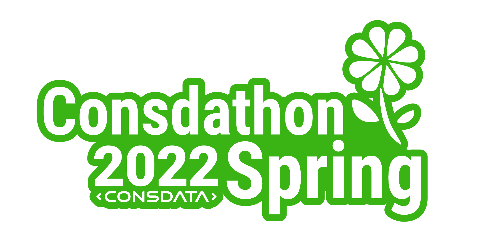

<h1 align="center">Cebulendarz - Twój prywatny asystent.</h1>

  
   
  <i>Cebulendarz pozwala łatwo i optymalnie kosztowo planować spotkania dla grupy osób. Jeśli musisz ustalić terminy spotkania z kilkoma osobami, Cebulendarz zrobi to za Ciebie. Oznacz, kiedy jesteś dostępny i wyślij jedno zaproszenie do wszystkich. Każdy uczestnik będzie mógł wybrać najbardziej odpowiadający mu termin bez zbędnej organizacji i pilnowania.</i>
   

  

TBD

  

